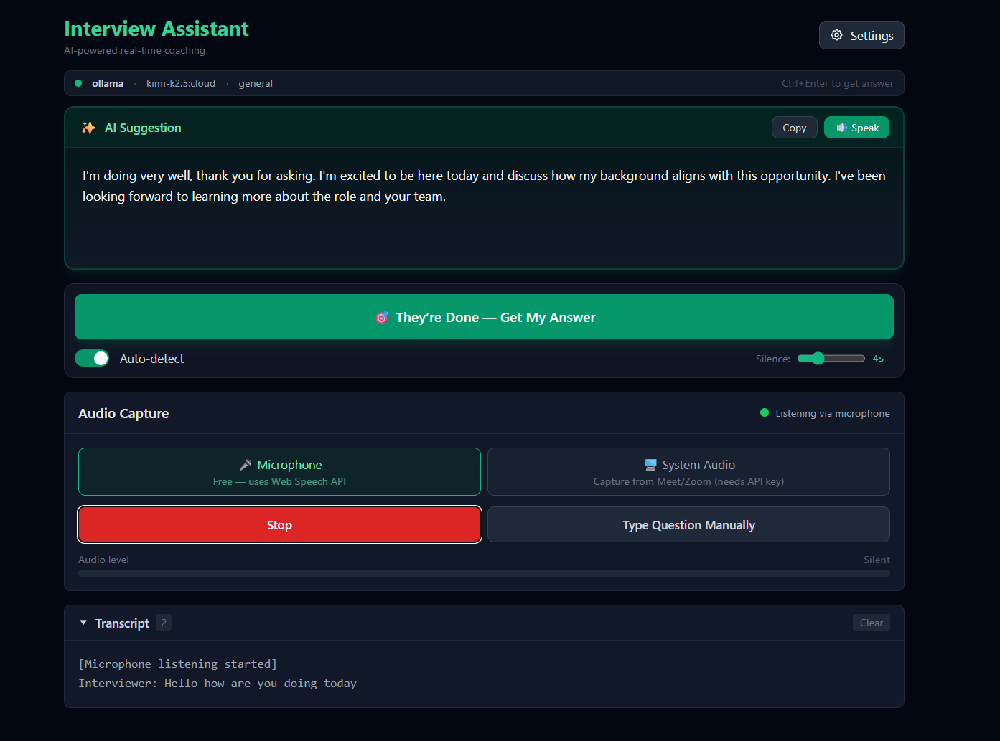
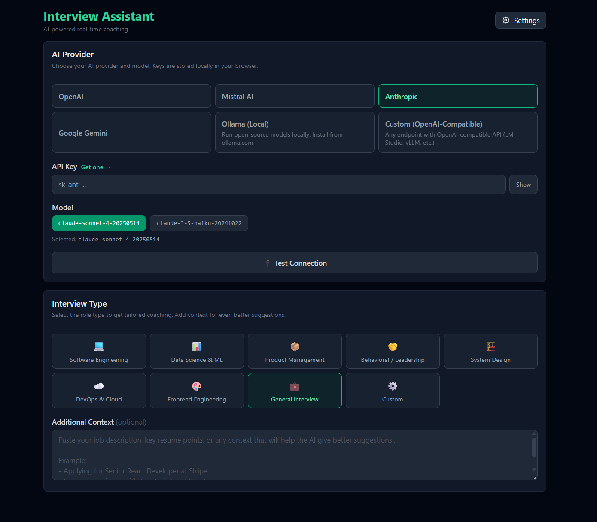

# AI Interview Assistant

Real-time AI-powered interview coaching tool. Get intelligent answer suggestions during live interviews with support for multiple AI providers — including free local models.

## Screenshots

<p align="center">
  
</p>

<p align="center">
  
</p>

## Features

- **Multi-Provider AI** — OpenAI, Mistral, Anthropic, Google Gemini, Ollama (local), or any OpenAI-compatible endpoint
- **Interview-Specific Coaching** — Tailored prompts for Software Engineering, Data Science, Product Management, System Design, Behavioral, DevOps, Frontend, and more
- **Custom Context** — Paste your job description, resume highlights, or company notes for personalized suggestions
- **Dual Audio Capture** — Microphone mode (free, Web Speech API) or system audio mode (captures Meet/Zoom audio)
- **Smart Auto-Send** — Detects silence pauses and automatically sends new speech for AI coaching (configurable 3–10s delay)
- **Test Connection** — Verify your AI provider configuration before the interview starts
- **Keyboard Shortcuts** — Press `Ctrl+Enter` to instantly send transcript for analysis
- **Zero Cost Option** — Use Ollama with local open-source models — no API key, no cloud, completely free
- **Privacy First** — API keys stored only in your browser's localStorage, never on any server
- **Electron Desktop App** — Standalone desktop version with system audio loopback support

## Quick Start

### Prerequisites

- [Node.js](https://nodejs.org/) 18+ installed
- (Optional) [Ollama](https://ollama.com/) for free local AI models

### Install & Run

```bash
git clone https://github.com/Aslanyan88/ai-interview-assistant.git
cd ai-interview-assistant
npm run setup
npm start
```

Open [http://localhost:3000](http://localhost:3000) in Chrome or Edge.

### Using Ollama (Free, Local AI)

1. Install Ollama from [ollama.com](https://ollama.com/)
2. Pull a small model: `ollama pull llama3.2` (2GB) or `ollama pull phi3` (2.3GB)
3. In the app, select **Ollama (Local)** as the provider — no API key needed

## Supported Providers

| Provider | Models | Free Tier | Notes |
|----------|--------|-----------|-------|
| **Ollama** | llama3.2, phi3, gemma, mistral, etc. | ✅ Fully free | Runs locally on your machine |
| **OpenAI** | GPT-4o, GPT-4o-mini, GPT-3.5 | Limited | [Get API key](https://platform.openai.com/api-keys) |
| **Mistral** | Large, Small, Nemo | Limited | [Get API key](https://console.mistral.ai/api-keys) |
| **Anthropic** | Claude Sonnet 4, Claude 3.5 Haiku | Limited | [Get API key](https://console.anthropic.com/settings/keys) |
| **Google Gemini** | 2.0 Flash, 1.5 Pro, 1.5 Flash | Generous | [Get API key](https://aistudio.google.com/app/apikey) |
| **Custom** | Any model | Varies | Any OpenAI-compatible endpoint (LM Studio, vLLM, etc.) |

## Interview Types

Choose a specialized coaching mode:

- 💻 **Software Engineering** — Technical questions, system design, coding concepts
- 📊 **Data Science & ML** — Statistics, ML algorithms, data analysis
- 📦 **Product Management** — Product sense, metrics, prioritization
- 🤝 **Behavioral** — STAR method, leadership, teamwork
- 🏗️ **System Design** — Architecture, scalability, trade-offs
- ☁️ **DevOps & Cloud** — CI/CD, infrastructure, cloud services
- 🎨 **Frontend** — React, performance, accessibility
- 💼 **General** — Broad interview preparation
- ⚙️ **Custom** — Your own instructions

## Project Structure

```
ai-interview-assistant/
├── server/                  # Express backend
│   ├── index.js             # API server (port 5000)
│   ├── providers/index.js   # Multi-provider AI registry
│   └── prompts.js           # Interview type system prompts
├── client/                  # Next.js frontend
│   └── app/
│       ├── page.js          # Main application page
│       └── components/
│           ├── ProviderConfig.js    # AI provider selection + test
│           ├── InterviewSetup.js    # Interview type & context
│           ├── AudioCapture.js      # Audio capture (mic + system)
│           └── AIResponse.js        # Response display
├── electron-app/            # Standalone desktop app
│   ├── main.js              # Electron main process
│   └── frontend-build/      # Pre-built frontend for Electron
├── package.json             # Root scripts (setup, start, build)
└── README.md
```

## How It Works

1. **Configure** — Pick an AI provider, enter API key (or use Ollama for free), then hit **Test Connection** to verify
2. **Set Context** — Choose interview type, optionally add job description/resume
3. **Capture** — Use microphone (free) or system audio to capture interviewer questions
4. **Get Coached** — Click "Get AI Suggestion" or press `Ctrl+Enter`. Enable **Auto-Detect** to send automatically after a silence pause

## Development

```bash
# Install all dependencies
npm run setup

# Start both server and client in dev mode
npm start

# Server only (port 5000)
cd server && npm start

# Client only (port 3000)
cd client && npm run dev
```

## Contributing

Contributions welcome! Please open an issue first to discuss what you'd like to change.

## License

MIT
